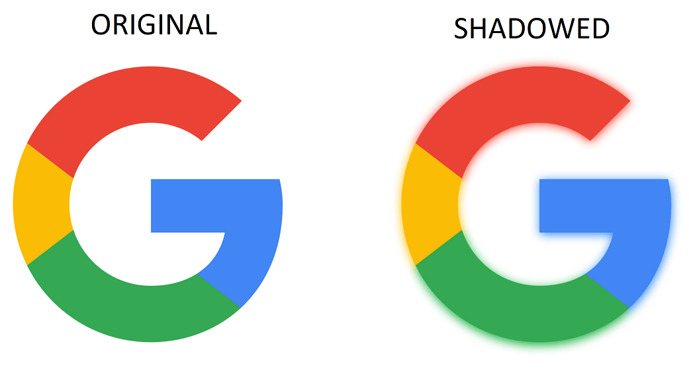

# ColoredShadowImageView

## ColoredShadowImageView allows you to create beautiful shadow, based on image colors.




### Download sample [apk](https://github.com/armcha/PlayTabLayout/tree/master/art/app.apk)

The current minSDK version is API level 16.
### Download
-----------------------

Gradle:
```groovy
implementation 'com.github.armcha:ColoredShadowImageView:1.0.0'
```
## Setup and usage

1. Static image
```xml
<io.github.armcha.coloredshadow.ShadowImageView
        android:id="@+id/shadowImage"
        android:layout_width="300dp"
        android:layout_height="400dp"
        android:src="@drawable/android"
```
Or

```kotlin
  findViewById<ShadowImageView>(R.id.shadowImage).apply {
       setImageResource(R.drawable.android)
  }
```

2. If you using Glide, use it in this way.
 Glide transformations also support.
 Now we have some limitations for Glide transitions
```kotlin
//shadowView.radiusOffset = 0.4f
//shadowView.shadowColor = ContextCompat.getColor(context,R.color.green)

GlideApp.with(itemView.context)
                    .load(item.imageUrl)
                    .placeholder(R.drawable.place_holder)
                    .error(R.drawable.place_holder)
                    //.transform(CircleCrop())
                    .into(object : ViewTarget<ImageView, Drawable>(shadowView) {
                        override fun onLoadStarted(placeholder: Drawable?) {
                            super.onLoadStarted(placeholder)
                            shadowView.setImageDrawable(placeholder, withShadow = false)
                        }

                        override fun onLoadCleared(placeholder: Drawable?) {
                            super.onLoadCleared(placeholder)
                            shadowView.setImageDrawable(placeholder, withShadow = false)
                        }

                        override fun onLoadFailed(errorDrawable: Drawable?) {
                            super.onLoadFailed(errorDrawable)
                            shadowView.setImageDrawable(errorDrawable, withShadow = false)
                        }

                        override fun onResourceReady(resource: Drawable, transition: Transition<in Drawable>?) {
                            shadowView.setImageDrawable(resource)
                        }
                    })
```

## Customizations

You can change shadow radius
Default radius is 0.5. You can change it between 0 and 1. (0 > radius >=1)
```kotlin
  shadowImageView.radiusOffset = 0.4f
  shadowImageView.setImageResource(R.drawable.android)
```

You can also change the shadow color
```kotlin
  shadowImageView.shadowColor = ContextCompat.getColor(context,R.color.green) //or Color.RED
  shadowImageView.setImageResource(R.drawable.android)
```


