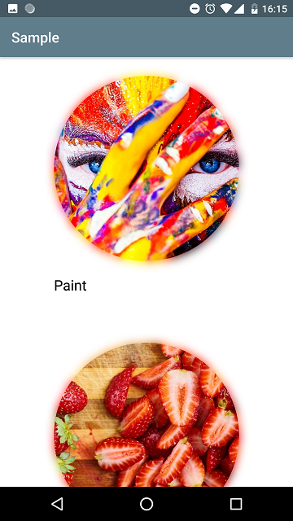
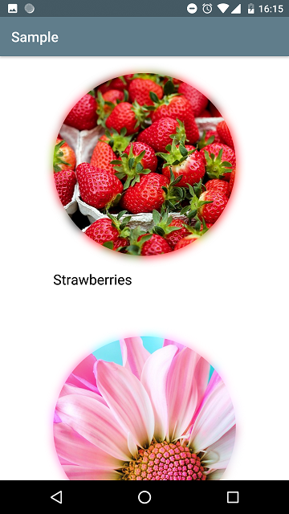

# ColoredShadowImageView

### ColoredShadowImageView allows you to create beautiful shadow around the image  based on corresponding area colors.





### Download sample [apk](https://github.com/armcha/PlayTabLayout/tree/master/art/app.apk)

The current minSDK version is API level 16.
### Download
-----------------------

Gradle:
```groovy
implementation 'com.github.armcha:ColoredShadowImageView:1.0.0'
```
## Setup and usage

1. Static image
```xml
<io.github.armcha.coloredshadow.ShadowImageView
        android:id="@+id/shadowImage"
        android:layout_width="300dp"
        android:layout_height="400dp"
        android:src="@drawable/android"
        app:radiusOffset="0.6"
        app:shadowColor="@color/colorAccent"
```
Or

```kotlin
  findViewById<ShadowImageView>(R.id.shadowImage).apply {
       setImageResource(R.drawable.android)
  }
```

2. If you are using Glide, use it in this way.
Glide transformations are also supported.
Now we have some limitations for Glide transitions.

```kotlin
//shadowView.radiusOffset = 0.4f
//shadowView.shadowColor = ContextCompat.getColor(context,R.color.green)

GlideApp.with(itemView.context)
                    .load(item.imageUrl)
                    .placeholder(R.drawable.place_holder)
                    .error(R.drawable.place_holder)
                    //.transform(CircleCrop())
                    .into(object : ViewTarget<ImageView, Drawable>(shadowView) {
                        override fun onLoadStarted(placeholder: Drawable?) {
                            super.onLoadStarted(placeholder)
                            shadowView.setImageDrawable(placeholder, withShadow = false)
                        }

                        override fun onLoadCleared(placeholder: Drawable?) {
                            super.onLoadCleared(placeholder)
                            shadowView.setImageDrawable(placeholder, withShadow = false)
                        }

                        override fun onLoadFailed(errorDrawable: Drawable?) {
                            super.onLoadFailed(errorDrawable)
                            shadowView.setImageDrawable(errorDrawable, withShadow = false)
                        }

                        override fun onResourceReady(resource: Drawable, transition: Transition<in Drawable>?) {
                            shadowView.setImageDrawable(resource)
                        }
                    })
```

## Customizations

You can change shadow radius.
Default radius is 0.5. You can change it between 0 and 1. (0 > radius >=1)
```kotlin
  shadowImageView.radiusOffset = 0.4f
  shadowImageView.setImageResource(R.drawable.android)
```

You can also change the shadow color
```kotlin
  shadowImageView.shadowColor = ContextCompat.getColor(context,R.color.green) //or Color.RED
  shadowImageView.setImageResource(R.drawable.android)
```
or from xml
```xml
   app:radiusOffset="0.6"
   app:shadowColor="@color/colorAccent"
```

Current limitations: 
-You can't use the library when setting width or height to "WRAP_CONTENT"

## Contact

Pull requests are more than welcome.

- **Email**: chatikyana@gmail.com
- **Medium**: https://medium.com/@chatikyan
- **Twitter**: https://twitter.com/ArmanChatikyan
- **Facebook**: https://web.facebook.com/chatikyana
- **Google +**: https://plus.google.com/+ArmanChatikyan
- **Website**: https://armcha.github.io/

License
--------

      PlayTabLayout
      Copyright (c) 2018 Arman Chatikyan (https://github.com/armcha/ColoredShadowImageView).

      Licensed under the Apache License, Version 2.0 (the "License");
      you may not use this file except in compliance with the License.
      You may obtain a copy of the License at

         http://www.apache.org/licenses/LICENSE-2.0

      Unless required by applicable law or agreed to in writing, software
      distributed under the License is distributed on an "AS IS" BASIS,
      WITHOUT WARRANTIES OR CONDITIONS OF ANY KIND, either express or implied.
      See the License for the specific language governing permissions and
      limitations under the License.
